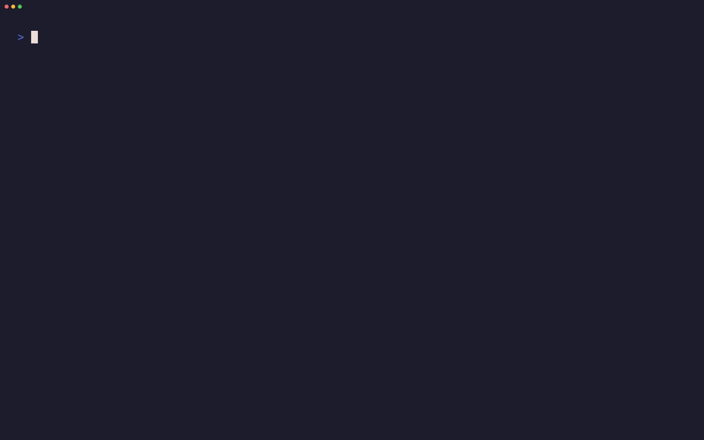

<p align="center">
  
</p>

<p align="center">
  <strong>Monorepo architecture health visualizer with animated TUI.</strong>
</p>

<p align="center">
  <a href="https://crates.io/crates/morpharch"></a>
  <a href="https://docs.rs/morpharch"></a>
  <a href="https://github.com/onplt/morpharch/actions/workflows/ci.yml"></a>
  <a href="https://github.com/onplt/morpharch#license"></a>
</p>

MorphArch scans monorepo Git history, builds per-commit dependency graphs using
tree-sitter AST parsing, calculates architectural health scores, and renders the
results as an animated force-directed graph in your terminal.

It supports Nx, Turborepo, pnpm workspaces, and Cargo workspaces out of the
box, with language-level import extraction for Rust, TypeScript, JavaScript, Python, and Go.

<p align="center">
  
</p>

---

## Features

- **Git history scanning** -- walk commit history with gix, extract file trees,
  and detect workspace configurations automatically.
- **Tree-sitter AST parsing** -- extract real import/dependency edges from
  source files in Rust, TypeScript (inc. JSX/TSX), JavaScript, Python, and Go.
- **Absolute Health scoring** -- quantify architectural integrity on a 0--100
  scale using cycle detection (Kosaraju SCC), boundary violation analysis, and
  context-aware coupling density metrics.
- **Animated TUI** -- Verlet physics force-directed graph layout rendered with
  ratatui and crossterm, featuring a timeline slider, k9s-inspired insight
  dashboard, and Catppuccin Mocha color theme.
- **Incremental scanning** -- subtree-cached tree walks (`O(changed_dirs)`)
  and an LRU blob import cache (50K entries) deliver 5--20x speedups on
  subsequent runs.
- **Parallel parsing** -- rayon-powered data-parallel import extraction across
  all workspace packages.
- **Mouse interaction** -- click and drag graph nodes to rearrange the layout
  in real time.
- **Search filtering** -- press `/` in the TUI to filter nodes by name.
- **SQLite persistence** -- all scan data is stored in
  `~/.morpharch/morpharch.db` for instant replay and historical analysis.
- **Cross-platform** -- runs on Linux, macOS, and Windows.

---

## Installation

### From crates.io

```bash
cargo install morpharch
```

### From source

```bash
git clone https://github.com/onplt/morpharch.git
cd morpharch
cargo build --release
# Binary is at target/release/morpharch
```

---

## Quick Start

```bash
# Scan a monorepo and build the database
morpharch scan /path/to/monorepo

# Scan and launch the animated TUI
morpharch watch /path/to/monorepo

# Analyze architecture for the current HEAD commit
morpharch analyze

# View the health trend over recent commits
morpharch list-drift
```

---

## Usage

### `morpharch scan <path>`

Scan a Git repository: walk commit history, build per-commit dependency graphs,
calculate health scores, and persist everything to the SQLite database.

```bash
# Scan the current directory (all commits)
morpharch scan .

# Scan a specific repo, limit to last 100 commits
morpharch scan /path/to/repo -n 100
```

| Flag | Description |
|------|-------------|
| `-n, --max-commits <N>` | Maximum commits to scan. `0` (default) means unlimited. |

### `morpharch watch <path>`

Perform a scan and then launch the animated TUI. The TUI displays a
force-directed graph of the dependency structure, a timeline slider for
navigating commit history, and a mission-control style dashboard with
real-time architectural insights.

| Flag | Description |
|------|-------------|
| `-n, --max-commits <N>` | Maximum commits to scan. `0` (default) means unlimited. |
| `-s, --max-snapshots <N>` | Maximum graph snapshots loaded into the TUI timeline. Default: `200`. |

### `morpharch analyze [commit]`

Display a detailed architectural report for a specific commit, including
health sub-metrics, boundary violations, circular dependencies, and AI-driven
improvement recommendations.

---

## TUI Keyboard Shortcuts

| Key | Action |
|-----|--------|
| `j` / `Down` | Navigate to the next (older) commit |
| `k` / `Up` | Navigate to the previous (newer) commit |
| `p` / `Space` | Play / pause auto-play through the timeline |
| `r` | Reheat the graph (re-energize Verlet temperature) |
| `/` | Enter search mode to filter nodes by name |
| `Esc` | Exit search mode, or quit the TUI |
| `q` | Quit the TUI |

---

## Architecture Health Scoring

MorphArch assigns each commit a system health score between **0 and 100**. Higher scores indicate a cleaner, more maintainable architecture.

| Health | Status | Description |
|--------|--------|-------------|
| **90-100** | **Clean** | Excellent structural integrity. Modular and cohesive. |
| **70-89**  | **Healthy** | Minor architectural debt, but no fatal flaws. |
| **40-69**  | **Warning** | Significant debt detected. Prone to ripple effects. |
| **0-39**   | **Critical** | Spagetti code. High structural risk; immediate refactoring required. |

The score uses a **6-component scale-aware algorithm** that calculates "Architectural Debt" and subtracts it from a base of 100. It dynamically scales its expectations based on the size of your repository, forgiving necessary complexity while harshly penalizing true anti-patterns.

- **Cycle Debt (30%):** Circular paths between packages that break modularity. Detected via Strongly Connected Components (Kosaraju's algorithm).
- **Layering Debt (25%):** Back-edges in the topological ordering of the dependency graph (boundary violations).
- **Hub/God Module Debt (15%):** Penalizes "God modules" that have both abnormally high incoming (Fan-in) and outgoing (Fan-out) dependencies, ignoring natural entry points (`main`, `index`, `app`).
- **Coupling Debt (12%):** Weighted coupling intensity based on the exact count of import statements between modules.
- **Cognitive Debt (10%):** Evaluates graph Shannon entropy. Penalizes structures where the sheer density of connections makes the system impossible for a human to reason about.
- **Instability Debt (8%):** Based on Martin's Abstractness/Instability metrics. Flags fragile modules that depend on everything but are depended upon by nothing.

---

## Contributing

1. Fork the repository and create a feature branch.
2. Ensure all tests pass: `cargo test`
3. Run clippy: `cargo clippy -- -D warnings`
4. Run fmt: `cargo fmt --all`

---

## License

Apache License, Version 2.0 or MIT License.
